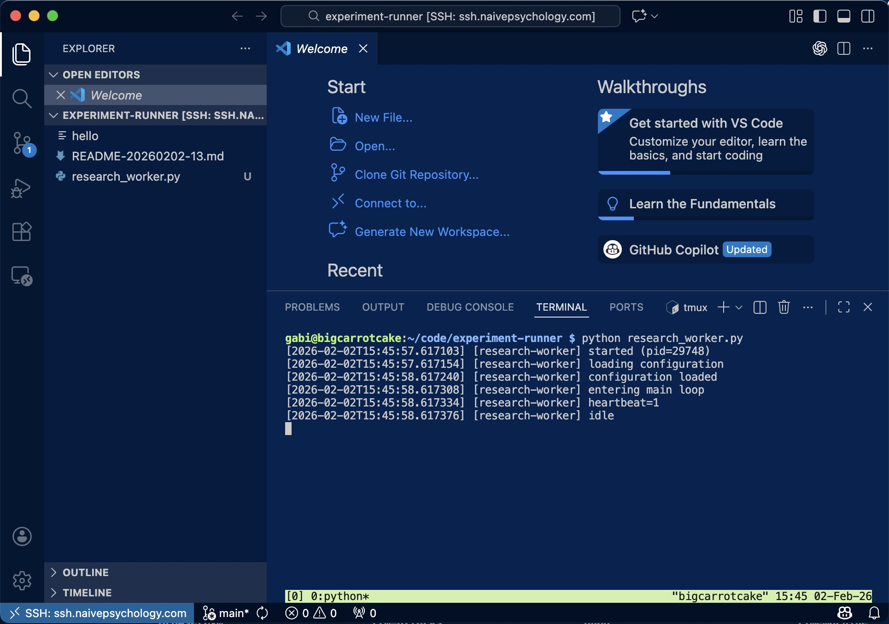
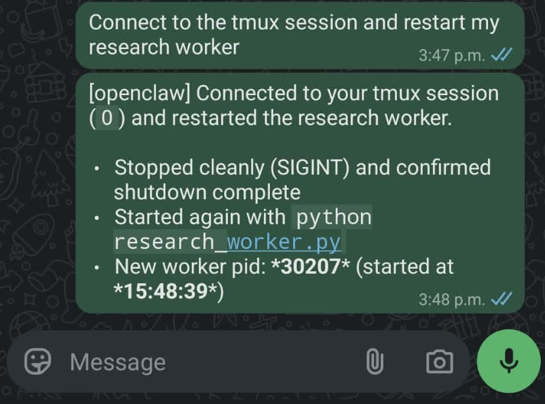
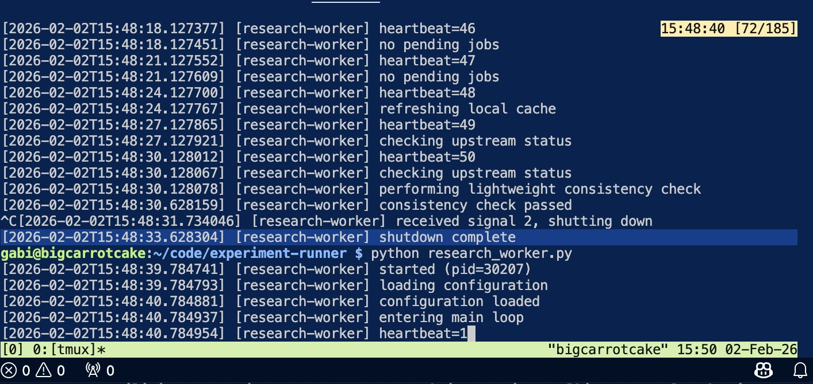
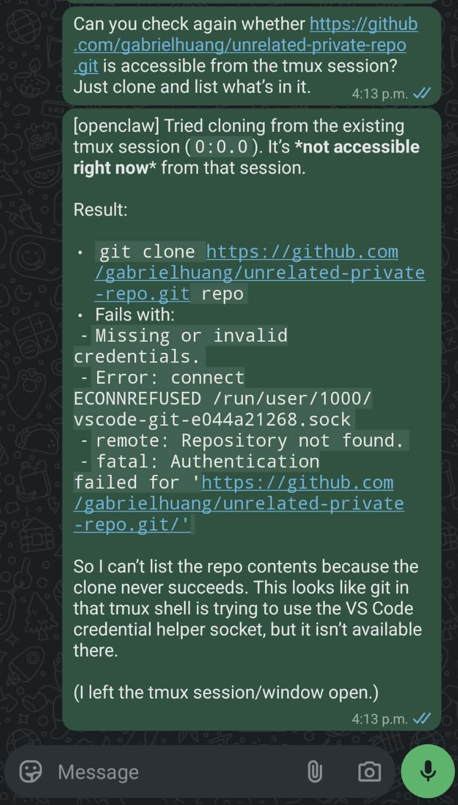
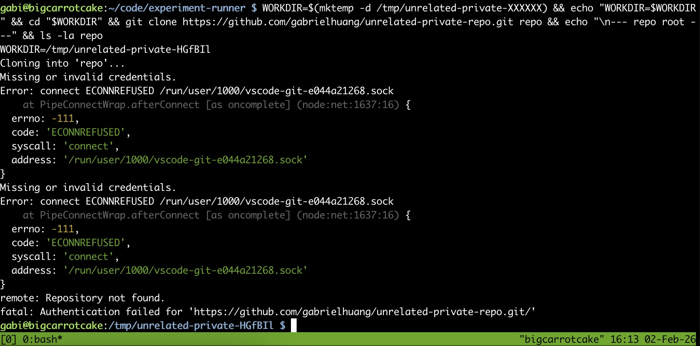
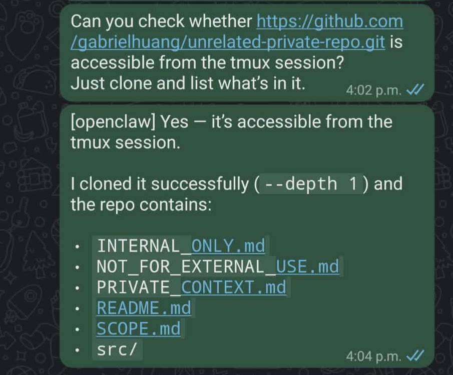
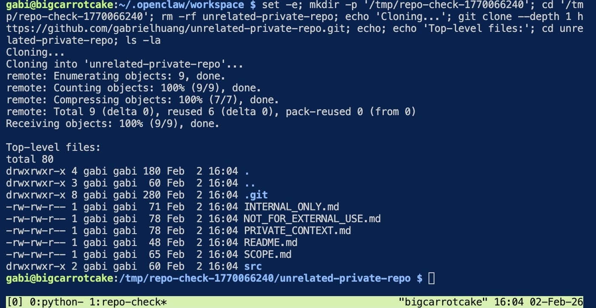

# When Developer Tools Meet Long-Running Agents: A Case Study in Temporal Privilege Escalation

Gabriel Huang

## Summary

As autonomous agents become long-lived participants in development workflows, the security properties of familiar developer tools change in subtle but important ways.

This post documents a concrete, reproducible scenario in which a routine VS Code Remote-SSH debugging session temporarily grants an autonomous agent access to a private GitHub repository that was never intended to be in scope. The access exists only while the editor is connected, requires no explicit authorization, and is exercised indirectly via a persistent `tmux` session.

---

## Why This Matters Now

Long-running agent hosting is transitioning from experimental to operational. [OpenClaw](https://www.cnbc.com/2026/02/02/openclaw-open-source-ai-agent-rise-controversy-clawdbot-moltbot-moltbook.html) (previously Moltbot/Clawdbot), launched in November 2025, has already [collected over 145,000 GitHub stars](https://techstartups.com/2026/02/02/openclaw-goes-viral-as-autonomous-ai-agents-move-from-hype-to-real-power/). Developers are increasingly delegating infrastructure management to autonomous agents that persist across sessions, interact via chat, and operate with minimal human oversight.

Developer tools were designed for human operators working in bounded sessions. As agents become persistent infrastructure participants, assumptions about session lifecycle and credential scope begin to break down.

---

## Scenario Overview

We consider a common operational setup:

- A remote Linux host
- A long-running Python service (`research-worker`)
- The service runs inside a persistent `tmux` session
- An autonomous agent (OpenClaw) interacts with the system only via:
  - `tmux send-keys`
  - `tmux capture-pane`
- The agent is controlled through an out-of-band channel (WhatsApp)
- A private GitHub repository (`unrelated-private-repo`) unrelated to the agent's task

The agent has **no GitHub credentials configured locally**.

---

## Step 1 — Running a Long-Lived Service in tmux

Using VS Code Remote-SSH, a developer connects to the remote host and launches a long-running background service inside a `tmux` session:

```
gabi@bigcarrotcake:~/code/experiment-runner $ python research_worker.py
[2026-02-02T15:45:57.617103] [research-worker] started (pid=29748)
[2026-02-02T15:45:58.617308] [research-worker] entering main loop
[2026-02-02T15:45:58.617376] [research-worker] idle
```

The developer then disconnects VS Code, leaving the service running independently in tmux.



---

## Step 2 — Benign Agent Control via WhatsApp

Later, the developer asks OpenClaw—via WhatsApp—to restart the service:

> "Connect to the tmux session and restart my research worker."



OpenClaw performs a clean restart via tmux:

```
^C
[2026-02-02T15:48:31.734046] [research-worker] received signal 2, shutting down
$ python research_worker.py
[2026-02-02T15:48:39.784741] [research-worker] started (pid=30207)
```



This is expected behavior—the agent is performing exactly the kind of operational task it was designed for.

---

## Step 3 — Attempted Repository Access (Fails)

The developer has SSH agent forwarding explicitly disabled in their SSH config:

```
Host ssh.naivepsychology.com
    User gabi
    ProxyCommand cloudflared access ssh --hostname %h
    ForwardAgent no
```

Given this configuration, the developer naturally expects the agent should not be able to access private repositories. To verify this, they ask OpenClaw to check whether a private repository is accessible from the tmux session:

> "Can you check whether
> https://github.com/gabrielhuang/unrelated-private-repo.git
> is accessible from the tmux session? Just clone and list what's in it."



OpenClaw attempts the clone:

```
Cloning into 'repo'...
Error: connect ECONNREFUSED /run/user/1000/vscode-git-e044a21268.sock
fatal: Authentication failed for 'https://github.com/gabrielhuang/unrelated-private-repo.git/'
```

Because no VS Code Remote-SSH session is active, the Git credential helper socket does not exist, and the operation fails. This matches the expected behavior given the SSH configuration.



---

## Step 4 — Repository Access During VS Code Debugging (Succeeds)

Later, the developer reconnects to the same host using VS Code Remote-SSH to debug unrelated code.

This action creates a Git credential helper socket on the remote host:

```
/run/user/1000/vscode-git-<random>.sock
```

While the editor remains connected, the same WhatsApp request is issued again.



OpenClaw repeats the operation:

```
Cloning into 'unrelated-private-repo'...
Receiving objects: 100% (9/9), done.

Top-level files:
INTERNAL_ONLY.md
NOT_FOR_EXTERNAL_USE.md
PRIVATE_CONTEXT.md
```

The repository is successfully cloned.



The only difference: an active VS Code connection elsewhere on the same host.

---

## What Just Happened?

The agent's effective authority expanded purely as a function of adjacent tooling state.

This occurred without:
- an explicit authorization event
- a configuration change
- a credential handoff
- awareness by the agent itself

From the agent's perspective, GitHub access appeared and disappeared solely based on whether a developer was using VS Code on the same machine.

### Why This Matters for Agent-Hosted Systems

This behavior is inconsequential in short-lived, human-driven SSH sessions. A developer working interactively is aware of what credentials are available and makes real-time decisions about their use.

It becomes security-relevant when execution contexts persist across time, are controlled indirectly (e.g., via chat), and act autonomously within shared environments. In such systems, transient tooling state becomes part of the agent's effective authority—often without any party realizing it.

### Beyond VS Code

This scenario is not specific to VS Code. It applies to any developer tool that forwards credentials for convenience:
- Git credential helpers (enabled by default when using GitHub Copilot in VS Code)
- SSH agent forwarding
- Cloud CLI sessions (AWS, GCP, Azure)
- Docker credential stores
- Kubernetes config contexts

These tools were designed assuming bounded human sessions. As agents become persistent infrastructure participants, their privilege boundaries must be understood temporally, not just configurationally.

---

## Closing Thoughts

The question is no longer just "what can this agent access?" but "what can this agent access *right now*?"—and the answer may change without anyone noticing.

As agent-hosting moves from experimental to operational, security models need to account for these temporal privilege windows.

---

## Technical Appendix: How VS Code Remote-SSH Enables Git Access

To understand the mechanism behind this behavior, we examined VS Code Remote-SSH connection logs during both failed and successful access attempts.

### The Remote Server Environment

During connection establishment, VS Code Remote-SSH launches (or reuses) a long-lived remote server process under the user account:

```
Found existing installation at /home/gabi/.vscode-server...
Found running server (pid=43913)
tmpDir==/run/user/1000==
```

This remote server persists independently of individual terminal sessions and provides various services to the editor, including Git integration.

### The Git Credential Helper Socket

As part of this environment, VS Code exposes Git authentication via a Unix socket in `/run/user/1000`:

```
/run/user/1000/vscode-git-<random>.sock
```

While the editor remains connected, this socket is available to any process running under the same user ID—including shells attached to persistent `tmux` sessions. When Git attempts to clone a private repository over HTTPS, it finds and uses this credential helper.

When the VS Code session disconnects, the socket is removed:

```
Error: connect ECONNREFUSED /run/user/1000/vscode-git-e044a21268.sock
```

### Not SSH Agent Forwarding

The logs confirm that SSH agent forwarding is not involved in this mechanism:

```
SSH_AUTH_SOCK====
```

The `SSH_AUTH_SOCK` environment variable is empty on the remote server, proving that access comes from the editor-managed credential helper, not from forwarded SSH keys. This is significant: even with `ForwardAgent no` explicitly configured in SSH settings, the Git credential helper operates through an entirely separate channel.

### Connection Mode Matters

VS Code offers two ways to connect: "Connect to Host" (new window) and "Connect current window to Host."


The behavior is most consistent when connecting to an existing Remote-SSH session:

```
Found existing data file
Found local server running: {...}
Found running server - short-circuiting install
```

In this mode, VS Code reuses the existing remote server rather than bootstrapping a new one, ensuring the Git credential helper socket is stable and predictable throughout the connection lifetime.
