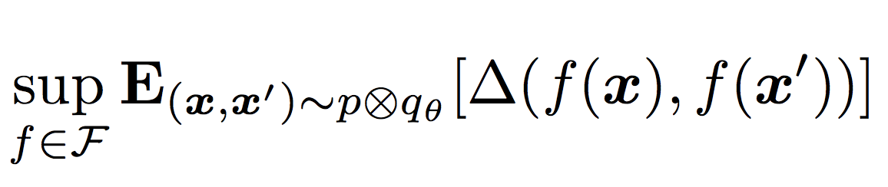

## Generative Modeling

<table>

<tr>
  
<td>

</td>

<td>
  
**Parametric Adversarial Divergences are Good Task Losses for Generative Modeling**  
Gabriel Huang, Gauthier Gidel, Hugo Berard, Ahmed Touati, Simon Lacoste-Julien.  
*ICML'17 Workshop on Principled Approaches to Deep Learning.* 
[[arxiv]](https://arxiv.org/abs/1708.02511) [[paper]](https://arxiv.org/pdf/1708.02511.pdf) [[poster]]({{ "/resources/icml17-poster.pdf" | absolute_url }})

</td>

</tr>

</table>
